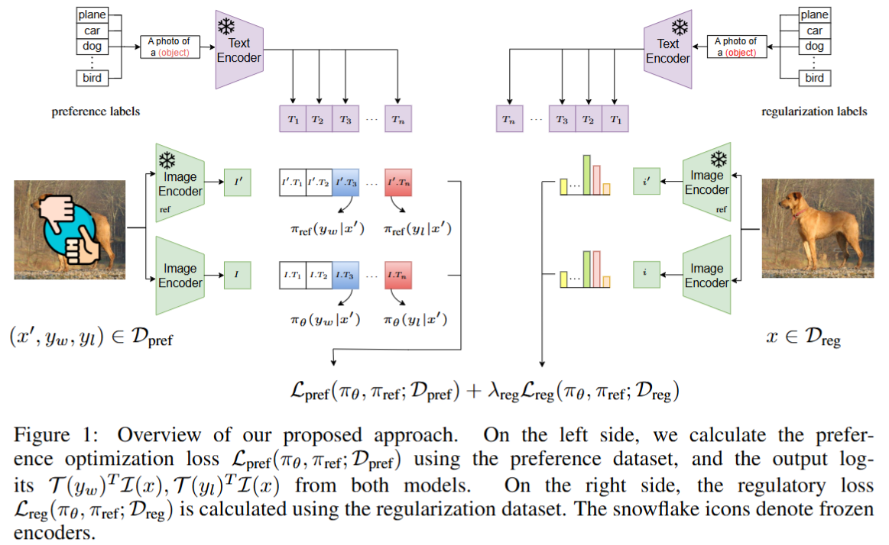

## Aligning Visual Contrastive Learning Models via Preference Optimization

This repository contains code for the paper "Aligning Visual Contrastive Learning Models via Preference Optimization" (_ICLR 2025_).

> **Authors:** Amirabbas Afzali, Borna Khodabandeh, Ali Rasekh, Mahyar JafariNodeh, Sepehr Kazemi, Simon Gottschalk  
> **Conference:** ICLR 2025  
> **ArXiv:** [arXiv:2411.08923](https://arxiv.org/abs/2411.08923)  
> **OpenReview:** [ICLR 2025 Submission](https://openreview.net/forum?id=wgRQ2WAORJ)  





## Abstract

Contrastive learning models have demonstrated impressive abilities to capture semantic similarities by aligning representations in the embedding space. However, their performance can be limited by the quality of the training data and its inherent biases. While Preference Optimization (PO) methods such as Reinforcement Learning from Human Feedback (RLHF) and Direct Preference Optimization (DPO) have been applied to align generative models with human preferences, their use in contrastive learning has yet to be explored. This paper introduces a novel method for training contrastive learning models using different PO methods to break down complex concepts. Our method systematically aligns model behavior with desired preferences, enhancing performance on the targeted task. In particular, we focus on enhancing model robustness against typographic attacks and inductive biases, commonly seen in contrastive vision-language models like CLIP. Our experiments demonstrate that models trained using PO outperform standard contrastive learning techniques while retaining their ability to handle adversarial challenges and maintain accuracy on other downstream tasks. This makes our method well-suited for tasks requiring fairness, robustness, and alignment with specific preferences. We evaluate our method on tackling typographic attacks on images and explore its ability to disentangle gender concepts and mitigate gender bias, showcasing the versatility of our approach.


## Citation

If you find this work useful, please cite:

```bibtex
@misc{afzali2025aligningvisualcontrastivelearning,
      title={Aligning Visual Contrastive learning models via Preference Optimization}, 
      author={Amirabbas Afzali and Borna Khodabandeh and Ali Rasekh and Mahyar JafariNodeh and Sepehr Kazemi and Simon Gottschalk},
      year={2025},
      eprint={2411.08923},
      archivePrefix={arXiv},
      primaryClass={cs.CV},
      url={https://arxiv.org/abs/2411.08923},
}
```

## License

This project is licensed under the MIT License.

